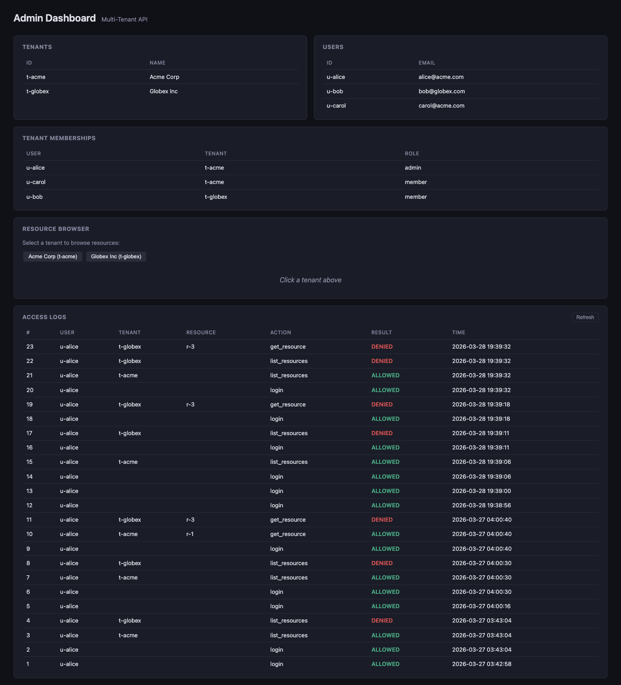

*How Shen sequent-calculus types and Go's compiler turn "remember to check" into "can't forget to check" — and the AI that built it didn't even know.*

---

Every multi-tenant SaaS app has the same nightmare: Tenant A sees Tenant B's data. You test for it. You code-review for it. You add middleware, add checks, add integration tests. And then someone writes a new endpoint and forgets the check, and you're writing a post-mortem.

What if you could make the correct authorization path so deeply embedded in the type system that skipping it becomes harder than doing it right? Not impossible in an absolute sense — a determined developer can always bypass anything. But impossible to *accidentally* bypass, which is where most real-world auth bugs come from.

This is a well-known idea — ["parse, don't validate"](https://lexi-lambda.github.io/blog/2019/11/05/parse-don-t-validate/), ["make illegal states unrepresentable"](https://fsharpforfunandprofit.com/posts/designing-with-types-making-illegal-states-unrepresentable/) — applied through a codegen bridge that generates Go types from a formal spec written in Shen's sequent calculus. The novelty isn't opaque types (Rust, Haskell, and others have had those for years). The novelty is the pipeline: **formal spec → generated guard types → compiler enforcement → AI coding loop with backpressure**.

## The Setup

I have a multi-tenant API. Two tenants: **Acme Corp** and **Globex Inc**. Three users: Alice (Acme admin), Carol (Acme member), Bob (Globex member). Standard stuff — JWT auth, SQLite, Go.


The question is: **how do you prove Alice can never see Globex's data?**

The standard answer is tests. You write `TestCrossTenantAccessRejected` and check that Alice gets a 403 when she tries to hit Globex's endpoint. Good. But that only proves it for the test case you wrote. If someone adds a new handler and forgets the authorization check, the test doesn't help — because the test doesn't exist yet for the new handler.

## The Proof Chain

Here's a different approach. Instead of testing individual endpoints, I define a **proof chain** in [Shen](https://shenlanguage.org/) — a Turing-complete Lisp with a type system based on sequent calculus:

```shen
(datatype jwt-token
  X : string;
  (not (= X "")) : verified;
  ============================
  X : jwt-token;)

(datatype token-expiry
  Exp : number;
  Now : number;
  (> Exp Now) : verified;
  =======================
  [Exp Now] : token-expiry;)

(datatype authenticated-user
  Token : jwt-token;
  Expiry : token-expiry;
  User : user-id;
  ===================================
  [Token Expiry User] : authenticated-user;)

(datatype tenant-access
  Auth : authenticated-user;
  Tenant : tenant-id;
  IsMember : boolean;
  (= IsMember true) : verified;
  ================================
  [Auth Tenant IsMember] : tenant-access;)

(datatype resource-access
  Access : tenant-access;
  Resource : resource-id;
  IsOwned : boolean;
  (= IsOwned true) : verified;
  ================================
  [Access Resource IsOwned] : resource-access;)
```

Read this like inference rules — premises above the line, conclusion below. To get a `resource-access`, you need a `tenant-access`. To get a `tenant-access`, you need an `authenticated-user` *and* proof of membership. To get an `authenticated-user`, you need a valid, unexpired JWT. Every link requires proving the previous one.

## The Bridge: shengen

Shen proves things deductively, but my API is in Go. So there's a codegen bridge — **shengen** — that parses the Shen spec and emits Go types with **unexported fields**:

```go
type TenantAccess struct {
    auth     AuthenticatedUser  // lowercase = unexported
    tenant   TenantId
    isMember bool
}

func NewTenantAccess(auth AuthenticatedUser, tenant TenantId, isMember bool) (TenantAccess, error) {
    if !(isMember == true) {
        return TenantAccess{}, fmt.Errorf("isMember must equal true")
    }
    return TenantAccess{
        auth:     auth,
        tenant:   tenant,
        isMember: isMember,
    }, nil
}
```

This is the trick that makes the whole thing work. In Go, lowercase struct fields are **unexported** — code outside the `shenguard` package literally cannot construct a `TenantAccess` struct directly. There is no syntax for it. `TenantAccess{auth: someUser, tenant: id, isMember: true}` won't compile from outside the package.

The *only* way to get a `TenantAccess` is through `NewTenantAccess()`. And `NewTenantAccess()` requires an `AuthenticatedUser` (which required a valid JWT and unexpired token) and checks that `isMember == true`.

**The proof chain enforces itself transitively.** Any function that accepts a `ResourceAccess` parameter has already proven:

1. The JWT was non-empty (JwtToken)
2. The token hasn't expired (TokenExpiry)
3. The user is authenticated (AuthenticatedUser)
4. The user is a member of the tenant (TenantAccess)
5. The tenant owns the resource (ResourceAccess)

Not "checked at runtime and might be skipped." *Cannot be constructed without proving each step.* The Go compiler rejects any code that tries to skip a link in the chain — at least from outside the `shenguard` package. (More on the boundaries of this guarantee in a moment.)

## In Practice

Here's what the middleware actually looks like:

```go
func Middleware(secret []byte) func(http.Handler) http.Handler {
    return func(next http.Handler) http.Handler {
        return http.HandlerFunc(func(w http.ResponseWriter, r *http.Request) {
            raw := extractBearer(r)
            result, err := Parse(raw, secret)
            if err != nil { /* 401 */ }

            // Build proof chain using guard type constructors
            jwtToken, err := shenguard.NewJwtToken(raw)
            expiry, err := shenguard.NewTokenExpiry(result.Exp, result.Now)
            userID := shenguard.NewUserId(result.Claims.Sub)
            authUser := shenguard.NewAuthenticatedUser(jwtToken, expiry, userID)

            ctx := context.WithValue(r.Context(), authUserKey, authUser)
            next.ServeHTTP(w, r.WithContext(ctx))
        })
    }
}
```

And the tenant access check:

```go
func CheckTenantAccess(db *sql.DB, authUser shenguard.AuthenticatedUser,
    tenantID shenguard.TenantId) (shenguard.TenantAccess, error) {

    var exists int
    db.QueryRow(
        "SELECT COUNT(*) FROM tenant_memberships WHERE user_id = ? AND tenant_id = ?",
        authUser.User().Val(), tenantID.Val(),
    ).Scan(&exists)

    isMember := exists > 0
    access, err := shenguard.NewTenantAccess(authUser, tenantID, isMember)
    // If isMember is false, NewTenantAccess returns an error.
    // No TenantAccess value is ever constructed.
    return access, err
}
```

Now here's the key: **a handler that takes `TenantAccess` as a parameter cannot be called without going through this check.** Not because of a convention or a code review checklist — because the type system won't allow it.

## The Live Demo

Alice logs in:

```
$ curl -s -X POST http://localhost:8080/auth/login \
  -H "Content-Type: application/json" \
  -d '{"email":"alice@acme.com","password":"alice123"}'

{
    "token": "eyJhbGciOiJIUzI1NiIs...",
    "user_id": "u-alice"
}
```

Alice requests her own tenant's resources — proof chain succeeds:

```
$ curl -s http://localhost:8080/tenants/t-acme/resources \
  -H "Authorization: Bearer $TOKEN"

[
    {"id": "r-1", "title": "Acme Roadmap", "body": "Q3 priorities..."},
    {"id": "r-2", "title": "Acme Budget", "body": "FY26 budget draft"}
]
```

Alice tries Globex's resources — proof chain breaks at TenantAccess:

```
$ curl -s -w '\n(HTTP %{http_code})' \
  http://localhost:8080/tenants/t-globex/resources \
  -H "Authorization: Bearer $TOKEN"

tenant access denied: user u-alice is not a member of tenant t-globex
(HTTP 403)
```

Even a direct resource lookup fails — you can't skip to ResourceAccess without TenantAccess:

```
$ curl -s -w '\n(HTTP %{http_code})' \
  http://localhost:8080/tenants/t-globex/resources/r-3 \
  -H "Authorization: Bearer $TOKEN"

tenant access denied: user u-alice is not a member of tenant t-globex
(HTTP 403)
```



## Why This Is Different From "Just Add Tests"

Tests are empirical — they check the cases you thought of. Guard types raise the bar: any code that participates in the proof chain gets compile-time enforcement for free, including endpoints that don't exist yet.

If someone adds a new handler that requires resource data, the path of least resistance is to accept a `ResourceAccess` parameter — which means the proof chain was already completed upstream. The *other* option is to extract raw IDs from the URL and query the database directly, bypassing the guard types entirely.

That bypass is always possible. This isn't Coq — we're not proving a security theorem. The guarantee is scoped: **code that uses guard types cannot accidentally skip validation.** Code that ignores them can do whatever it wants. The value proposition is making the safe path easier than the unsafe path, and making the unsafe path visibly different in code review (raw string IDs instead of typed proofs).

This is defense in depth, not a silver bullet. You should still pair it with database-level Row Level Security, integration tests, and runtime monitoring. But the guard types catch the most common failure mode: an honest developer (or AI agent) who simply forgot the middleware.

## What the Guard Types Don't Cover

Let's be honest about the trusted computing base. The guarantee only holds if:

- **The `shenguard` package is correct.** Code *inside* the package can forge any guard type — it has access to unexported fields. This is the security kernel and should be treated accordingly: generated by shengen, never hand-edited, reviewed carefully.
- **The SQL queries are correct.** `CheckTenantAccess` runs `SELECT COUNT(*) FROM tenant_memberships WHERE user_id = ? AND tenant_id = ?`. A wrong `WHERE` clause would silently break the invariant while the types still check out. The proof chain validates that the *check happened*, not that the check was *implemented correctly*.
- **All entry points go through the middleware.** A handler registered without the auth middleware can accept requests without an `AuthenticatedUser` in context. The type system catches this at the handler level (no `AuthenticatedUser` means no `TenantAccess`), but the router doesn't enforce it.
- **TOCTOU gaps.** The membership check happens at request time. If a user is removed from a tenant mid-request, the proof is stale. For most apps this is fine — for high-assurance systems, you'd want tighter coupling.

None of this is unique to guard types — it's the same trusted computing base you'd have with any authorization middleware. The difference is that guard types make the *boundary* between verified and unverified code explicit and compiler-checked, instead of relying on convention.

## The Part That Blew My Mind

This entire API — the database schema, JWT handling, auth middleware, tenant checks, resource handlers, admin dashboard, integration tests — was built autonomously by a [Ralph loop](https://ghuntley.com/ralph/). An AI coding agent running in a bash loop:

```
while :; do cat PROMPT.md | claude-code; done
```

Eight plan items. Eight iterations. **Zero gate failures.**

That's not because the AI understood formal verification — it's because the guard types left it no wrong path. When the LLM tried to construct guard types incorrectly, `go build` failed, the error was fed back as [backpressure](https://banay.me/dont-waste-your-backpressure), and it corrected itself. The formal properties emerged from the type system, not from the model's reasoning. The `PROMPT.md` was heavily scaffolded with instructions about how to use the guard types, but the compiler did the actual enforcement.

Five gates ran every iteration:

| Gate | Command | What It Catches |
|------|---------|----------------|
| 1. shengen | `./bin/shengen-codegen.sh` | Spec-to-types drift |
| 2. go test | `go test ./...` | Runtime invariant violations |
| 3. go build | `go build ./...` | Type signature mismatches |
| 4. shen tc+ | `./bin/shen-check.sh` | Contradictory specs |
| 5. tcb audit | `./bin/shenguard-audit.sh` | Hand-edited generated code, unexpected files in shenguard/ |

The gates form a "spec sandwich" — Gates 1 and 4 verify the formal foundation (synchronized and consistent), while Gates 2 and 3 verify the implementation (tested and compiled). No gap between the math and the code.

```
$ make all

./bin/shengen-codegen.sh specs/core.shen shenguard internal/shenguard/guards_gen.go
Generated internal/shenguard/guards_gen.go from specs/core.shen (package shenguard)
go test ./...
ok  	multi-tenant-api/internal/auth
ok  	multi-tenant-api/internal/db
ok  	multi-tenant-api/internal/handlers
go build ./...
./bin/shen-check.sh
RESULT: PASS
Shen type check passed for specs/core.shen
```

## The Backpressure Hierarchy

There's a growing conversation about backpressure in AI coding loops. [Banay](https://banay.me/dont-waste-your-backpressure) frames it as a spectrum from build systems to proof assistants. [Ghuntley](https://ghuntley.com/ralph/) defines the Ralph loop pattern. [HumanLayer](https://www.humanlayer.dev/blog/context-efficient-backpressure) focuses on making backpressure context-efficient.

What I'm adding to the conversation is a hierarchy:

```
Level 0: Syntax        — does it parse?
Level 1: Types         — does it compile?
Level 2: Tests         — do specific cases pass?
Level 3: Proof chain   — are invariants enforced for ALL inputs?
Level 4: Deductive     — is the spec itself consistent?
```

Most AI coding loops operate at levels 0-2. Shen-Backpressure adds levels 3 and 4. Each level catches failures the levels below miss. Tests can pass with contrived values. A compiler can accept code that bypasses validation. The proof chain catches *structural* violations — you forgot to thread the authorization proof, and the compiler tells you.

Is this a full deductive security proof? No. The Shen type checker verifies the spec is internally consistent, and the codegen bridge turns the spec into compile-time enforcement. But the SQL queries, the membership lookup, the middleware wiring — those are still in the trusted computing base. It's closer to "refined smart constructors with a formal spec backing them" than to a machine-checked security theorem.

But for AI coding loops, that's exactly the right trade-off. You don't need a proof engineer. You don't need the LLM to understand formal verification. You write a Shen spec (Lisp syntax — LLMs handle it well), shengen generates guard types, and the compiler does the rest. The verification is invisible to the AI writing the code, and that's the point — strong oracles (compiler + type checker) elevate AI-generated code quality without requiring the model to reason about security.

---

*[Shen-Backpressure](https://github.com/pyrex41/Shen-Backpressure) is open source. The multi-tenant demo shown here is at `demo/multi-tenant-api/`. The verifiable showboat demo for this post is at `blog/post-3-impossible-by-construction/demo.md` — run `showboat verify demo.md` to confirm every command output is real.*

*This is part of a series on deterministic backpressure for AI coding. Next: [One Spec, Every Language](/posts/one-spec-every-language/) -- how the same Shen spec generates guard types across Go, TypeScript, Rust, and Python. Then: [Five Ways to Bypass a Guard Type](/posts/bypass-taxonomy/) -- the hardening deep dive.*
